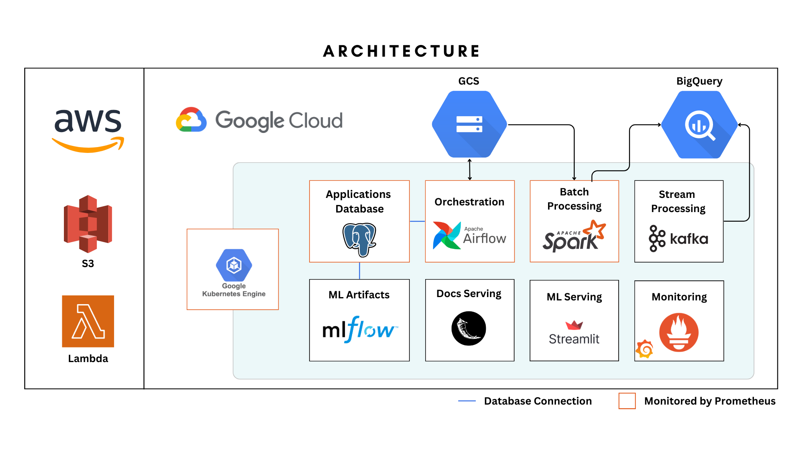
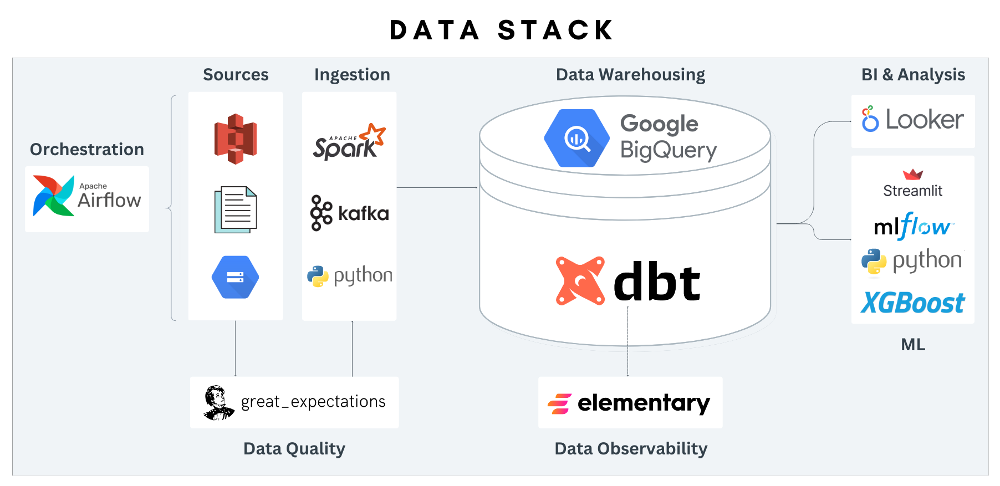
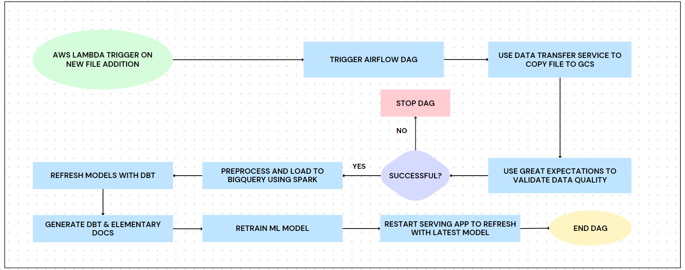
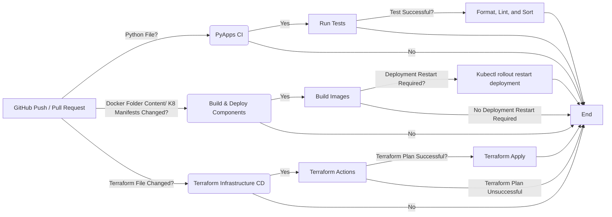

# Overview

This project showcases the orchestration of a scalable data pipeline using `Kubernetes` and `Apache Airflow`. It incorporates a comprehensive data ecosystem, including `Spark`, `Kafka`, and `DBT`, while maintaining a strong focus on data quality. 
<br> With NYC Taxi data stored in S3 as the starting point, this pipeline goes beyond generating a standard BI dashboard. It also delivers a prediction service and data models tailored specifically for data scientists' needs.


<details>
  <summary>Table of Contents</summary>
  <ol>
    <li><a href="#explore-some-project-deliverables">Explore Some Project Deliverables</a></li>
    <li>
      <a href="#architecture">Architecture</a>
      <ul>
        <li><a href="#visually-summarized-architecture">Visually Summarized Architecture</a></li>
        <li><a href="#data-stack">Data Stack</a></li>
        <li><a href="#airflow-job-dag-flowchart">Airflow Job DAG Flowchart</a></li>
        <li><a href="#cicd-pipelines">CICD Pipelines</a></li>
      </ul>
    </li>
    <li><a href="#extra-notes-on-technologies-used">Extra Notes on Technologies Used</a></li>
    <li><a href="#testing">Testing</a></li>
    <li><a href="#how-to-install">How to Install</a></li>
  </ol>
</details>


## Explore Some Project Deliverables:

<i>**Kindly note that the services are hosted using free GCP credits and may not be available once the credits are exhausted.</i>


- **Static Docs**: 
    * `Great Expectations`: [Link](http://35.204.125.16:5000/) | [Screenshot](images/great-expectations-result.png)
    * `DBT Docs`: [Link](http://35.204.125.16:5000/dbt#!/overview) | [Screenshot](images/dbt-screenshot.png) 
    * `Elementary Docs`: [Link](http://35.204.125.16:5000/elementary) | [Elementary Dashboard](images/elementary-dashboard.png)
- **ML Serving/Prediction Service**: [Link](http://34.90.214.205:8501/) | [Screenshot](images/streamlit-prediction-app)
- **MLFlow**: [Screenshot](images/mlflow-screenshot.png)

You can find extra documentation in the `docs/` dir.

## Architecture

### **Visually Summarized Architecture**

<p align="center">  </p>

### **Data Stack**

<p align="center">  </p>

### **Airflow Job DAG Flowchart**

<p align="center">  </p>

### **CICD Pipelines**


### Extra Notes on Technologies Used:
- `Flask`: Used to serve static documentation websites for `DBT`, `Great Expectation`, and `Elementary`.
- `Prometheus`: Collects metrics from various sources including `Airflow` (via `Statsd`), `SparkApplications` (via `JMX Prometheus Java Agent`), `Postgres` (via `prometheus-postgres-exporter`), and Kubernetes (via `kube-state-metrics`).
- `Grafana` Utilized to visualize the metrics received by Prometheus. The Grafana folder contains JSON dashboard definitions created to monitor Airflow and Spark.
- `Kafka`: Integrated as a streaming solution in the project. It reads a file and utilizes its rows as streaming material.
- `Streamlit`: Used to serve the best `xgboost` model from the `MLFlow` Artifact Repository.
- `gitsync`: Implemented to allow components to directly read their respective code from GitHub without needing to include the code in the Docker image.
- `Spark-on-K8s`: Utilized to run Spark jobs on Kubernetes.


## **Testing**
Other than standard unit testing, the below was also done. 

### **Data Quality Tests**
- Data quality is validated on **ingestion** using Great Expectations.
- All data source and models have `dbt expectations` data quality tests.
- There are also unit tests where a sample input and expected output are used to test the model. 

### **Integration Tests**
An integration test for the lambda function can be found in the `tests/integration` directory.


## How to Install:
### Prerequisites

-   [Google Cloud SDK](https://cloud.google.com/sdk/docs/install) with Kubectl.

### Installation

1.  Clone the repository:

```shell
git clone https://github.com/Elsayed91/taxi-data-pipeline
```
2.  Rename template.env to .env and fill out the values, you dont need to fill out buckets or `AUTH_TOKEN` values.
3.  Run the project setup script it will prompt you to login to your gcloud account, do so and it will do the rest.

```shell
make setup
```
4. to manually trigger the `batch-dag`:
```shell
make trigger_batch_dag
```
* to run kafka
```shell
make run_kafka
```
* to destroy kafka instance
```shell
make destroy_kafka
```
* to run the lambda integration test
```shell
make run_lambda_integration_test
```

<br>Note: to use the workflows, a GCP service account as well as the content of your `.env` file need to be added to your Github Secrets.

