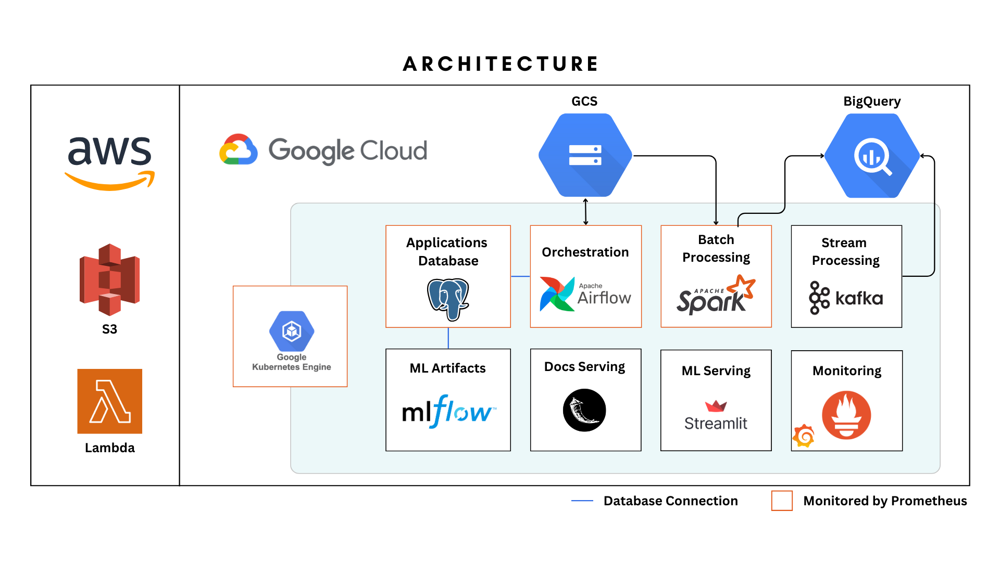
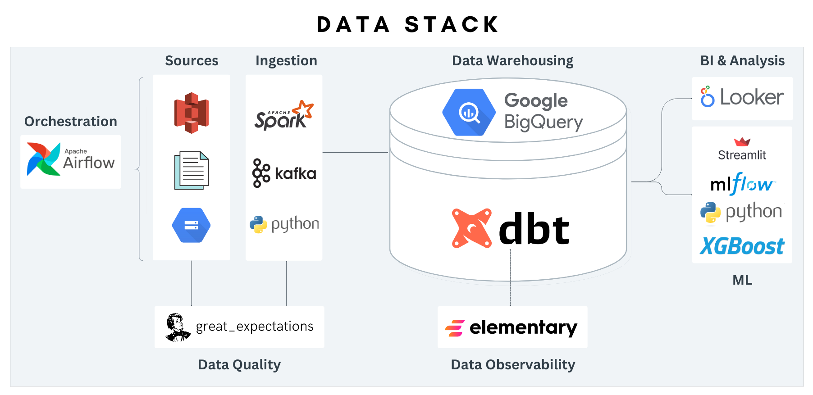
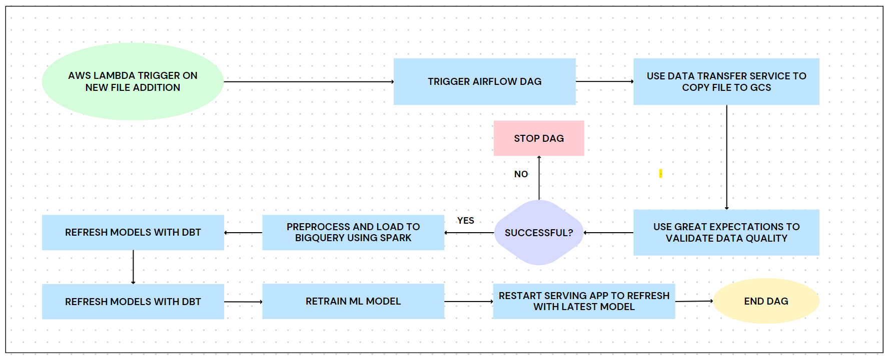

# Overview
This project utilizes New York City yellow taxi data to construct a scalable and automated data pipeline. It involves orchestrating the workflow using `Kubernetes` and `Apache Airflow`, transforming and loading data across various cloud service providers, and processing and loading it into `BigQuery` with the assistance of `Apache Spark`. The data stored in BigQuery serves as the foundation for creating models using `DBT`, which can be accessed by both BI users and Data Scientists for developing ML models. The pipeline not only trains these ML models but also serves them. To ensure data quality, the project implements DBT tests and leverages `Great Expectations`. Additionally, the project attempts to demonstrate capability of working with Data Science and MLOps tasks. 

## Components

To view different technologies explored in the project, check some links below. Note that the services are hosted using free GCP quote. meaning the link could go down anytime. 
- **Airflow:** [Initial Load DAG Screenshot](images/initial-load-dag-screenshot.png) | [Batch DAG Screenshot](images/batchdag_screenshot.png) | [Docs](docs/airflow.md)
- **DocsApp**: 
    * `Great Expectations`: [Link](http://35.204.125.16:5000/validations/yellow_expectations/202307080726-yellow/20230708T072645.492439Z/0a79ac4ed3c2ec10d366e04e50a2885a.html) | [Screenshot](images/great-expectations-result.png)
    * `DBT Docs`: [Link](http://35.204.125.16:5000/dbt#!/overview) | [Screenshot](images/dbt-screenshot.png) 
    * `Elementary Docs`: [Link](http://35.204.125.16:5000/elementary) | [Elementary Dashboard](images/elementary-dashboard.png)

- Grafana: [Screenshot](images/grafana-screenshot.png)
- ML Serving/Prediction Service: [Link](http://34.90.214.205:8501/) | [Screenshot](images/streamlit-prediction-app)
- MLFlow: [Screenshot](images/mlflow-screenshot.png)

## Architecture

### **Visually Summarized Architecture**

  

### **Data Stack**

  

### **Airflow Job DAG Flowchart**

  

## Continuous Integration and Deployment (CI/CD)

The project employs CI/CD pipelines to ensure reliable and automated deployment. 

### Overview of the CI/CD processes for different components:

-   **Terraform and Lambda CI/CD**: The Terraform infrastructure and Lambda function have dedicated CI/CD pipelines. These pipelines apply infrastructure changes after formatting and validating, ensuring consistency and reliability.
    
-   **Python Applications CI/CD**: Python applications within the project have CI/CD pipelines that run tests, linting, and formatting. These pipelines ensure the code's quality and conformity to standards.
    
-   **Docker and Kubernetes Components CI/CD**: Docker images are built, and attached Kubernetes deployments are restarted (if they exist) through dedicated CI/CD pipelines. These pipelines facilitate the deployment and management of containerized applications.
    
-   **Kubernetes Manifest Changes**: Changes to Kubernetes manifests trigger restarts for relevant deployments. A tool is utilized to automatically restart deployments when config maps or secrets are modified, ensuring seamless updates.

## **Testing**
### **Standard Unit Tests**
- Most functions have unit tests attached, the ones that do not are ones based completely off 3rd party libraries (like great expectations)
- There are some unit tests to test Airflow dag loading and default settings

### **Data Unit Tests**
there are **data** unit tests in DBT to test the model logic. this is done by providing a sample input and expected output and testing the model with them.

### **Integration Tests**
An integration test for the lambda function can be found in the tests/integration directory.

### **Data Quality**
- Data quality is validated on **ingestion** using Great Expectations.
- Data is divided into clean and triage data using Spark, where conditions are provided to ensure that clean data meets standard.
- All data source and models have dbt expectations data quality tests.

## **CI/CD**
**Github actions** is used for CICD workflows.
there are multiple workflows defined.

1. **Components**: this defines the workflow for docker images and kubernetes deployments.
If there is change in a docker directory, a new image is built and the corresponding deployment (if exists) is restarted.
If there is a change in a manifest directory, the change is applied.

2. **Code**: this includes automatically running tests and linting on code change.

3. **Terraform**: on changes to the terraform directory, terraform apply is run to apply these changes

4. **Lambda**: on changes to the lambda directory, integration test is carried out and then new lambda is deployed

Additionally **pre-commit** is used with a number of hooks to ensure that changes adhere to some best practices. 
 Note: to use the workflows, a GCP service account as well as the content of your `.env` file need to be added to your Github Secrets.

## How to Install:

## Thoughts

- While it is usual to use multiple processing tools like Spark & DBT at the same time, for the scope of this project, just using Spark would provide maximum efficiency at lowest cost, however the decision to still use DBT is based on 2 reasons:
1. Documentation and Testing:
Data quality and unit testing for Spark can be done, but it is not as convinent as when using DBT.
Additionally the ability to document everything with extreme ease is absolutely valuable.
2. Showcase usage
Simply put, I wanted to display my ability at using different tools.

