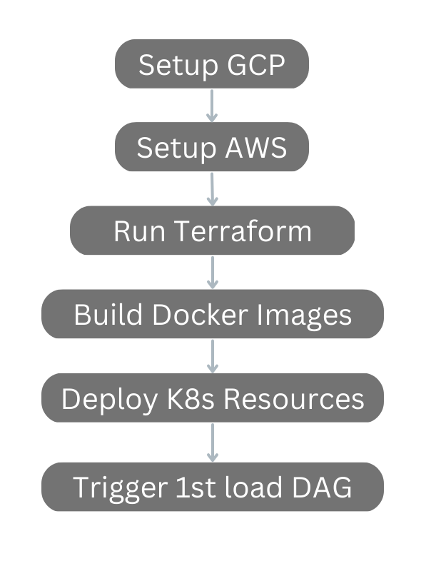

## **Structure**
```
├── functions.sh
├── random_env.csv
└── setup.sh
```

this directory contains some help scripts, the most important being setup.sh


### **Setup.sh**

While Terraform is responsible for the creation of the infrastructure, this script
sets everything in motion.

It does the following:




#### **Setup GCP**

This part includes the creation of the project and activation of needed APIs mainly.
It includes other things like turning on usage of kaniko in cloud build and adding missing permissions to data transfer service account.

#### **Setup AWS**

Configures the default values for AWSCLI

#### **Run Terraform**
Runs terraform to provision the infrastructure

#### **Build Docker Images**
Uses cloudbuild.yaml to build all the docker images required by the project.

#### **Deploy K8s Resources**
Sets up the kubernetes service account by annotating it (GKE workload identity) and patching it for image pull secrets.
Additionally it gets cluster credentials and deploys all yaml manifests.

#### **Trigger 1st load DAG**
Triggers the airflow dag that is responsible to do the initial load for the project.


### **functions.sh**

Includes some helper functions.

- `generate_random_env`: uses a csv file to generate environmental variables that require some randomness, like password or unique bucket names.
this may not be the best way but it keeps the code clean and is perfectly extensible.

- `mass_kubectl`: an enhanced version of kubectl that allows directory traversing and is paired with envsubst to replace any ${VAR} values in the manifests if needed.

- `wait_for_all_pods`: a small script that recursively iterates over the status of deployments untill all are ready. 
this is used to ensure that the deployments are ready before triggering the dag.